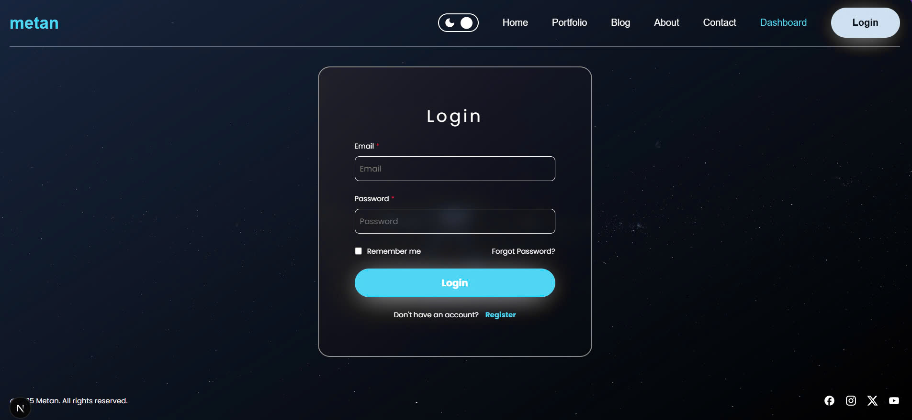

# 📝 Blog Web Application
A simple blog web application built to practice full-stack development with Next.js. The app allows users to register, log in, and manage their personal blog posts. The focus of this project is mainly on the frontend interface and user flow.

## 🌟 Features
- Authentication:

  + Secure sign-in/sign-up using Auth.js.

- Blog Management:

  + Create, view, and delete blog posts (requires login).

  + Public access to read posts.

- Basic UI:

  + Simple interface styled with CSS Modules. (Not responsive)

## 💻 Technologies Used
### ✔️ Front-end & Back-end
- Next.js: Fullstack React framework used for both frontend and backend logic.

- __React__: UI components and state handling.

- __CSS Modules__: For component-scoped styling.

- __Auth.js__: For authentication handling.

- __Fetch API, SWR__: To communicate with API routes.

### ✔️ Database
- __MongoDB__: To store user and post data.

- __Mongoose__: For schema definition and database interaction.

## 🚀 Getting Started
1. Clone the project:
```
git clone https://github.com/Havold/blog-METAN.git
cd blog-app
```
2. Install dependencies:
```
npm install
```
3. Create .env with:
```
MONGO = <YOUR_MONGO_TO_CONNECT>

GOOGLE_CLIENT_ID = <YOUR_GOOGLE_CLIENT_ID>
GOOGLE_CLIENT_SECRET = <YOUR_GOOGLE_CLIENT_SECRET>
AUTH_SECRET= <YOUR_AUTH_SECRET>
NEXTAUTH_URL = http://localhost:3000
```
4. Run the app:
```
npm run dev
```
## 🖼️ Screenshots
__1. Login Page__


__2. Register Page__


__3. Home Page__


__4. Dashboard (Student Role)__


__5. List of Blogs__


__6. About__

